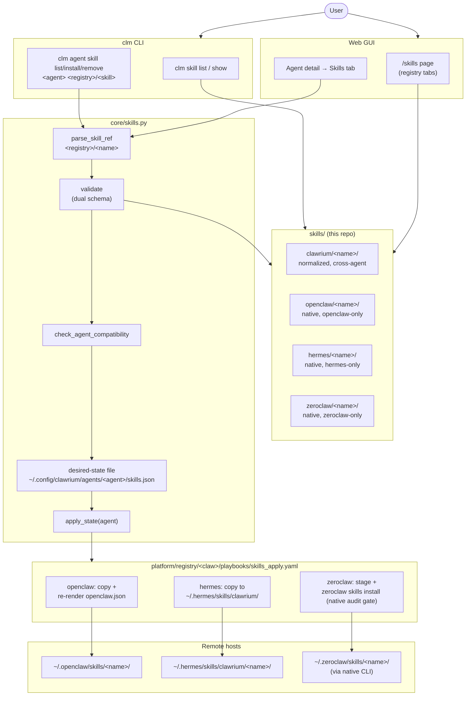

# Issue #364 — Skills Registry (v4 plan)

User can install vetted skills from clawrium-managed registries onto any agent. Skills are sourced **only** from this repo's `skills/` tree — split into a normalized cross-agent `clawrium/` namespace and per-claw native namespaces (`openclaw/`, `hermes/`, `zeroclaw/`). No URLs, no arbitrary paths, no other install sources.

## Workflow



### ASCII rendering

```
                          ┌──────────┐
                          │   User   │
                          └─────┬────┘
              ┌─────────────────┴──────────────────┐
              ▼                                    ▼
   ┌────────────────────────┐         ┌────────────────────────┐
   │        clm CLI         │         │       Web GUI          │
   │                        │         │                        │
   │ clm skill list / show  │         │ /skills page           │
   │                        │         │ (registry tabs)        │
   │ clm agent skill        │         │                        │
   │   list/install/remove  │         │ Agent detail           │
   │   <agent>              │         │   → Skills tab         │
   │   <registry>/<skill>   │         │                        │
   └───────────┬────────────┘         └───────────┬────────────┘
               │                                  │
               └──────────────────┬───────────────┘
                                  │
                                  ▼
   ┌──────────────────────────────────────────────────────────────┐
   │                     core/skills.py                           │
   │                                                              │
   │   parse_skill_ref ──► validate ──► check_agent_compat        │
   │   (<registry>/<n>)    (dual         (clawrium=any,           │
   │                       schema)        <claw>/<n>=match only)  │
   │                          │                                   │
   │                          ▼                                   │
   │   ┌──────────────────────────────────────────────────────┐   │
   │   │  desired-state file                                  │   │
   │   │  ~/.config/clawrium/agents/<agent>/skills.json       │   │
   │   └──────────────────────────┬───────────────────────────┘   │
   │                              │                               │
   │                              ▼                               │
   │                        apply_state(agent)                    │
   └──────┬───────────────────────┬──────────────────────┬────────┘
          │                       │                      │
          ▼                       ▼                      ▼
   ┌─────────────┐         ┌─────────────┐        ┌──────────────┐
   │  openclaw   │         │   hermes    │        │   zeroclaw   │
   │ skills_     │         │  skills_    │        │   skills_    │
   │ apply.yaml  │         │  apply.yaml │        │  apply.yaml  │
   │             │         │             │        │              │
   │ copy +      │         │ copy →      │        │ stage +      │
   │ re-render   │         │ ~/.hermes/  │        │ `zeroclaw    │
   │ openclaw.   │         │ skills/     │        │  skills      │
   │ json        │         │ clawrium/   │        │  install`    │
   │             │         │             │        │ (audit gate) │
   └──────┬──────┘         └──────┬──────┘        └──────┬───────┘
          │                       │                      │
          ▼                       ▼                      ▼
   ┌─────────────┐         ┌────────────────┐    ┌─────────────────┐
   │  ~/.open    │         │ ~/.hermes/     │    │ ~/.zeroclaw/    │
   │  claw/      │         │ skills/        │    │ skills/<name>/  │
   │  skills/    │         │ clawrium/      │    │ (via native     │
   │  <name>/    │         │ <name>/        │    │  CLI)           │
   └─────────────┘         └────────────────┘    └─────────────────┘

   skills/ catalog (this repo) — read by core/skills.py
   ┌─────────────────────────────────────────────────────────────┐
   │  clawrium/<name>/   normalized, cross-agent                 │
   │  openclaw/<name>/   native, openclaw-only                   │
   │  hermes/<name>/     native, hermes-only                     │
   │  zeroclaw/<name>/   native, zeroclaw-only                   │
   └─────────────────────────────────────────────────────────────┘

   Idempotency: every install/remove re-runs apply_state.
   Drift recovery = re-run install (no explicit reconcile command).
```

Re-running any `install` / `remove` always reconciles local → remote. There is no explicit reconcile command; drift recovery is "re-run install".

## Architecture decisions (locked)

1. **Namespaced catalog.** `skills/<registry>/<name>/`. `clawrium/` = normalized superset that satisfies all three native schemas; `<claw>/` = native-format skills installable only on agents of that type.
2. **Skill reference is `<registry>/<name>`.** Bare names rejected with `MissingRegistryPrefix` and a hint.
3. **Local desired-state is truth.** `install` / `remove` mutate `~/.config/clawrium/agents/<agent>/skills.json` and always invoke the per-claw `skills_apply.yaml`. No short-circuit.
4. **Per-claw mechanism follows the native idiom**:
   - openclaw — `copy` + re-render `openclaw.json` if this fork is config-driven (phase-0 verifies)
   - hermes — `copy` to `~/.hermes/skills/clawrium/<name>/` (auto-scan)
   - zeroclaw — stage + `zeroclaw skills install <staging-path>` so the native security audit runs
5. **Pruning is bounded** to a clawrium-owned subtree per claw. Never touches user-authored or upstream-bundled skills.
6. **External sources blocked** at `parse_skill_ref`. Single chokepoint.
7. **CLI is verb-first** to match existing `clm agent <verb> <agent-name>` pattern.

## CLI surface

**Catalog (global):**
- `clm skill list [--registry <registry>]`
- `clm skill show <registry>/<name>`

**Per-agent:**
- `clm agent skill list <agent-name>`
- `clm agent skill install <agent-name> <registry>/<skill-name>`
- `clm agent skill remove <agent-name> <registry>/<skill-name>`

Resolution rules at install:
1. `<registry>/<skill>` must exist in `skills/<registry>/<skill>/`.
2. `clawrium/<name>` → installable on any agent.
3. `<claw>/<name>` → installable only on a matching agent type.
4. No bare-name install.

## Files to add / modify

**Catalog**
- `skills/README.md` — namespace rules, authoring guide
- `skills/_schema/clawrium.schema.json`
- `skills/_schema/native/{openclaw,hermes,zeroclaw}.schema.json`
- `skills/clawrium/tdd/{SKILL.md,README.md,_meta.yaml}` — first skill, adapted from Hermes bundled TDD; fields populated to satisfy all three native schemas
- `skills/{openclaw,hermes,zeroclaw}/README.md` — namespace placeholders

**Core**
- `src/clawrium/core/skills.py` — `parse_skill_ref`, `load_skill`, `validate_skill` (dual schema), `check_agent_compatibility`, `apply_state`
- `src/clawrium/core/skills_state.py` — desired-state file read/write, entries stored as `<registry>/<name>`

**Per-claw materialization**
- `src/clawrium/platform/registry/openclaw/playbooks/skills_apply.yaml`
- `src/clawrium/platform/registry/hermes/playbooks/skills_apply.yaml`
- `src/clawrium/platform/registry/zeroclaw/playbooks/skills_apply.yaml`

**CLI**
- `src/clawrium/cli/skill.py` — `list`, `show`
- `src/clawrium/cli/agent.py` — register new `skill` sub-app: `list`, `install`, `remove`
- `src/clawrium/cli/main.py` — wire top-level `skill_app`

**GUI backend**
- `src/clawrium/gui/routes/skills.py` — `GET /api/skills` (grouped by registry), `GET /api/skills/{registry}/{name}`
- `src/clawrium/gui/routes/agents.py` — extend with `GET /api/agents/{agent}/skills`, `POST /api/agents/{agent}/skills/{registry}/{skill}`, `DELETE /api/agents/{agent}/skills/{registry}/{skill}`
- `src/clawrium/gui/server.py` — register skills router

**GUI frontend**
- `gui/src/app/skills/page.tsx` — registry-tab catalog browse
- `gui/src/app/agents/page.tsx` — new Skills tab on agent detail (filtered install picker: `clawrium/*` + matching `<claw>/*`)
- `gui/src/components/skills/{SkillCard,SkillDetail,AgentSkillsPanel}.tsx`

**CI**
- `.github/workflows/skills-validate.yml` — dual-schema validation, path-traversal check, schema-mismatch (clawrium schema under `skills/zeroclaw/` etc.) rejected
- `scripts/validate_skills.py` — CLI wrapper for local + CI

**Docs**
- `docs/skills/index.md`, `docs/skills/authoring-clawrium.md`, `docs/skills/authoring-native.md`
- `website/docs/skills/{intro,authoring}.md`
- `AGENTS.md` quickstart update with `clm agent skill install` example

**Tests**
- `tests/test_core_skills.py` — schema validation, dual-schema dispatch, idempotency
- `tests/test_skills_namespace.py` — `MissingRegistryPrefix`, `IncompatibleSkillRegistry`, `SkillNotFound`, external-source blocked
- `tests/test_cli_skill_agent.py` — verb-first surface, drift recovery (re-run after manual file delete)
- `tests/test_skills_apply_{openclaw,hermes,zeroclaw}.py` — mocked `ansible-runner`, install → list → remove round-trip per claw; zeroclaw test asserts native `zeroclaw skills install` is invoked, not raw copy
- `tests/test_gui_skills_routes.py`
- `gui/src/app/skills/page.test.tsx`, `gui/src/components/skills/AgentSkillsPanel.test.tsx`

## Phased execution

| Phase | Scope | Exit criteria |
|---|---|---|
| 0 | Unblockers (no PR) | Verify whether openclaw in this fork is auto-scan or config-driven; confirm zeroclaw on-host path `~/.zeroclaw/skills/<name>/`; lock TDD normalized frontmatter that passes all three native schemas |
| 1 | Schema + core loader + namespaced catalog + TDD seed | `skills/clawrium/tdd/` validates; `skills/{openclaw,hermes,zeroclaw}/` exist with READMEs; `parse_skill_ref` + dual validator tested |
| 2 | Desired-state store + `apply_state` entrypoint | CLI + GUI both consume one stable API; round-trip on a fake claw works in tests |
| 3 | Per-claw `skills_apply.yaml` for all three claws | Round-trip install/remove on each claw via mocked ansible-runner; zeroclaw uses native CLI; pruning bounded |
| 4 | CLI surface with namespaced refs and error classes | All five commands work; error messages stable and tested |
| 5 | GUI catalog page + agent-detail Skills tab | Manual smoke + page-level Vitest |
| 6 | Docs + CI dual-schema + end-to-end tests per claw | `make test` + `make lint` green; CI rejects schema-mismatch fixtures |

## Test strategy

- Unit: schema validation per registry, `parse_skill_ref` errors, state-file round-trip, agent-type compatibility check.
- Integration: install → list → remove on each claw with mocked ansible-runner; drift recovery (delete remote-equivalent then re-run install — must reconverge).
- Security: install-from-URL rejected; install-from-absolute-path rejected; native-format file under `clawrium/` rejected; pruning never touches files outside the clawrium-owned subtree.
- GUI: route 200/404/422 paths; page renders + install dialog flow.
- `make test` and `make lint` must pass.

## Risks / open questions

| # | Item | Default |
|---|------|---------|
| Q1 | Hermes namespace for clawrium skills: `~/.hermes/skills/clawrium/<name>/` | Yes |
| Q2 | openclaw discovery: auto-scan vs config-driven | Phase 0 verifies; if config-driven, re-render `openclaw.json` |
| Q3 | Seed per-claw folders with one native skill in v1 | No — empty placeholders; one PR adds later |
| Q4 | Strict refs (`<registry>/<name>`) vs auto-prefix `clawrium/` | Strict; clearer errors |
| Q5 | zeroclaw idempotency: `zeroclaw skills install` re-runs on already-installed | Check `zeroclaw skills list` first; install only on diff |

## Subtasks

To be created under this issue after plan approval (one per phase 1–6). Phase 0 is research, no PR.

---

<details>
<summary>Prompt Log</summary>

**Stage**: planning
**Skill**: /itx:plan-create
**Timestamp**: 2026-05-17T00:00:00Z
**Model**: claude-opus-4-7

```prompt
/itx-plan-create 364
```

Iterations in conversation refined the design:
1. v1: included GUI in scope (user override of issue's "out of scope: web UI"); cross-agent install via `clm skill install <skill> <agent>`.
2. v2: restructured to per-agent CLI under `clm agent`, local-as-source-of-truth idempotency, all three claws in scope (not deferred), one skill installable on all three.
3. v3: verb-first CLI (`clm agent skill <verb> <agent> <skill>`), no reconcile command (drift = re-run install), sentinel markers dropped after upstream docs review.
4. Researched upstream docs: openclaw (Claude Code) auto-scan at `~/.claude/skills/`; hermes auto-scan at `~/.hermes/skills/<category>/<name>/`; zeroclaw native `zeroclaw skills install` CLI with a security audit gate. Confirmed file-drop for openclaw/hermes, native CLI wrap for zeroclaw.
5. v4 (this plan): namespaced catalog — `skills/clawrium/` for cross-agent normalized skills, `skills/<claw>/` for native-format per-agent skills. Skill ref is `<registry>/<name>`. No external sources.

Customer outcome (carried from issue): "Browse the clawrium-managed skills registries and install any vetted skill onto any of their agents."

</details>
