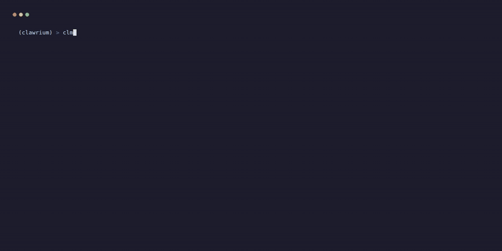

#  Clawrium - An aquarium for *claws

<p align="center">
  Fleet management for AI agents on your local network.
</p>

<p align="center">
  <a href="https://github.com/ric03uec/clawrium/actions/workflows/test.yml"></a>
  <a href="https://pypi.org/project/clawrium/"></a>
  <a href="https://pypi.org/project/clawrium/"></a>
  <a href="https://github.com/ric03uec/clawrium/blob/main/LICENSE"></a>
</p>

<p align="center">
  <a href="https://ric03uec.github.io/clawrium/">Documentation</a> · <a href="https://github.com/ric03uec/clawrium/issues">Issues</a> · <a href="https://github.com/users/ric03uec/projects/1">Roadmap</a> · <a href="https://discord.gg/KzPuSxgQ98">Discord</a>
</p>

---

## How it works

<p align="center">
  
</p>

Clawrium uses Ansible under the hood for SSH-based orchestration. You run `clawctl` from your control machine, which talks to target hosts over SSH. No agents, no containers, no Kubernetes complexity - just processes running on hosts with a unified management layer.

## Why Clawrium

You're running multiple AI agents - coding assistants, internal tools, experiment harnesses - across machines on your network. Without Clawrium, you SSH into each box, manage configs individually, lose track of token spend, and have no unified view of what's running where.

Clawrium gives you `kubectl`-style fleet control for AI agents:

- **One CLI, all hosts.** Add machines to your fleet and deploy any agent type to any host.
- **Specialized agents.** Each agent does one job and does it well. Instead of one overloaded assistant, run a fleet of purpose-built agents - a coding agent, a review agent, a research agent - each with its own context, data, and configuration isolated from the rest.
- **Local inference.** Use hardware you already have - Mac Minis, [NVIDIA DGX Spark](https://www.nvidia.com/en-us/products/workstations/dgx-spark/), spare servers - as inference providers. Run smaller open models like Gemma, GPT-4o-mini, Kimi, or Llama locally and point multiple agents at them.
- **Model experimentation.** Swap models across agents to compare performance without touching individual configs.
- **Lifecycle management.** Upgrades, rollbacks, secrets rotation, backups - handled.
- **Token tracking & guardrails.** See spend across your fleet. Set limits before someone's experiment burns through your API budget.

## What is a "Claw" or an Agent?

A **Claw** or an Agent is a general-purpose AI assistant that runs on a host in your network. Unlike coding-focused assistants (Copilot, Cursor), Claws are designed for broader tasks:

- **[OpenClaw](https://github.com/openclaw/openclaw)** - Open-source general assistant
- **[ZeroClaw](https://github.com/zeroclaw-labs/zeroclaw)** - Lightweight assistant for resource-constrained hosts
- **[IronClaw](https://github.com/nearai/ironclaw)** - High-performance assistant for demanding workloads

Clawrium manages the lifecycle of these agents across your fleet - install, configure, start, stop, upgrade, monitor.

## Who this is for

Clawrium is for **engineers running AI agents in non-trivial setups** - home labs, dev teams, research groups. If you have more than one agent running on more than one machine, this tool exists for you.

It is _not_ a hosted platform. There's no dashboard, no SaaS, no account signup. It's a Python CLI that talks to your machines via Ansible. You own everything.

## Quickstart

### What You'll Need

| Requirement | Why |
|-------------|-----|
| Python 3.10+ | Runtime for `clawctl` CLI |
| [uv](https://docs.astral.sh/uv/) | Fast Python package installer |
| SSH access to a remote host | Clawrium manages agents over SSH |
| API key (Anthropic, OpenAI, etc.) | Agents need inference providers |

<p align="center">
  
</p>

### Install & Run

```bash
# Install
uv tool install clawrium

# Or run without installing
uvx --from clawrium clawctl --help
```

For full installation instructions including how to install `uv`, see [docs/installation.md](docs/installation.md).

### 5-Minute Setup

```bash
# Initialize config
clawctl service init
# → Created /home/user/.config/clawrium/config.yaml

# Register your host. First run generates a per-host SSH keypair and
# prints the manual xclm setup commands (Linux + macOS) you need to
# run on the host — see docs/host-preparation.md.
clawctl host create 192.168.1.100 --user xclm --alias worker-1
# → Generating SSH keypair for '192.168.1.100'...
# → xclm SSH verification failed: Authentication failed - check SSH keys
# → Manual setup required. (paste printed block on the host, then re-run)

# Re-run after running the printed setup commands on the host:
clawctl host create 192.168.1.100 --user xclm --alias worker-1
# → host/worker-1 created on 192.168.1.100:22

# Register an inference provider
clawctl provider registry create anthropic --type anthropic --api-key-stdin
# → Provider 'anthropic' configured

# Install OpenClaw agent
clawctl agent create my-assistant --type openclaw --host worker-1 --provider anthropic
# → Installing openclaw on worker-1...
# → Agent 'my-assistant' installed

# Configure and start
clawctl agent configure my-assistant
clawctl agent start my-assistant
# → Agent 'my-assistant' started

# Check fleet status
clawctl agent get
# NAME           TYPE       HOST       PROVIDER    STATUS    AGE
# my-assistant   openclaw   worker-1   anthropic   running   2m

# Chat with your agent
clawctl agent chat my-assistant
# → Connected to my-assistant
# → Type your message...

# Or open the local web dashboard
clawctl gui
# → Clawrium GUI starting on http://127.0.0.1:36000 — press Ctrl+C to stop
```

**You should see:** A running agent in `clawctl agent get` output with status `running`.

**→ Full setup guide: [ric03uec.github.io/clawrium](https://ric03uec.github.io/clawrium/)**

## Key Concepts

| Concept | What it is |
|---------|-----------|
| **Host** | A machine in your network running one or more agents |
| **Agent** | An installed AI assistant instance managed by Clawrium |
| **Agent Type** | The implementation/runtime class of an agent |
| **Agent Name** | The unique identifier for an installed agent instance |
| **Registry** | Platform-defined agent types with versions, dependencies, and templates |

## FAQ

### 1. What operating systems are supported?

Right now, Clawrium is only tested on Ubuntu hosts and Ubuntu control machines.

Other Linux distributions may work, but they are not currently part of the test matrix.

### 2. Which agents are supported today?

[OpenClaw](https://github.com/openclaw/openclaw) is officially supported and tested end-to-end.

[Hermes](https://github.com/NousResearch/hermes-agent) (Nous Research) is supported in `🚧 In Development` status — install, configure, and a local OpenAI-compatible HTTP API on `127.0.0.1:8642` are wired end-to-end. `clawctl agent chat` and external messaging gateways are not yet supported for hermes. See the [Hermes Support Matrix](https://ric03uec.github.io/clawrium/docs/agent-support/hermes) for details.

Additional agent types are planned.

### 3. Is Claude subscription supported?

No. Clawrium supports API keys only, by design.

### 4. Which channels are supported?

[Discord](https://ric03uec.github.io/clawrium/docs/agent-support/channels/discord) and [Slack](https://ric03uec.github.io/clawrium/docs/agent-support/channels/slack) are supported for OpenClaw.

Additional channels are planned.

### 5. Does Clawrium install Docker or Kubernetes?

No. Clawrium does not require Docker or Kubernetes. It manages agent processes over SSH using Ansible.

### 6. Can I manage multiple hosts with different agent types?

Yes. You can register multiple hosts and run different agent types on each host from the same `clawctl` control node.

### 7. Why doesn't it support x-agent and y-feature?

I'm building Clawrium in my spare time, so I prioritize my own use cases first.

If you want support for a specific agent type or feature, please open an issue and send a PR. See [CONTRIBUTING.md](CONTRIBUTING.md) for contribution guidelines.

### 8. Why not Kubernetes?

**Two reasons:**

1. **Most AI agent runtimes don't support it.** These run as local processes, not containerized services. They expect a home directory, local config files, and direct access to the host. Wrapping them in containers adds friction with no payoff.

2. **K8s is overkill for local fleets.** You're managing 3-10 machines on a LAN, not orchestrating microservices across cloud regions. Kubernetes brings etcd, control planes, networking overlays, RBAC, and a learning curve that dwarfs the problem. You don't need a container scheduler - you need to SSH into a box and run a process.

**Clawrium uses Ansible under the hood instead.** Ansible gives you idempotent host management, secrets handling, and multi-machine orchestration without requiring anything on the target machines beyond SSH. Clawrium sits on top of Ansible and adds the agent-specific layer: lifecycle management, token tracking, model swapping, and fleet-wide visibility.

## Tech Stack

Python · [Typer](https://typer.tiangolo.com/) · [ansible-runner](https://ansible-runner.readthedocs.io/) · [uv](https://docs.astral.sh/uv/)

## Contributing

```bash
git clone https://github.com/ric03uec/clawrium && cd clawrium
make test       # Run tests
make lint       # Check style
make format     # Auto-format
```

Issues are the source of truth. See [CONTRIBUTING.md](CONTRIBUTING.md) for the full workflow.

## License

Apache 2.0
