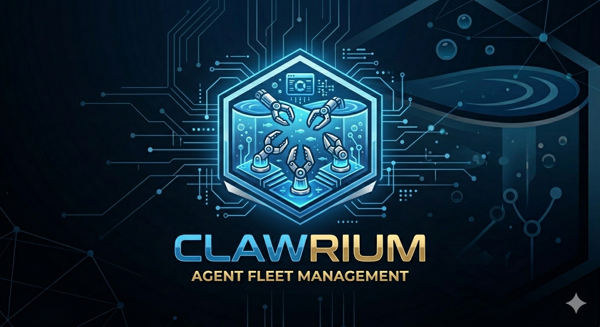
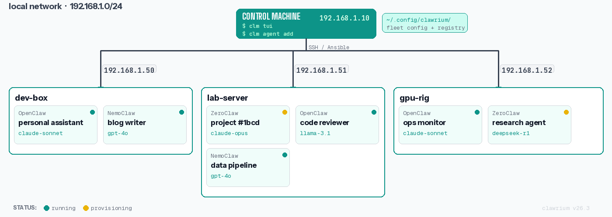

#  Clawrium - An aquarium for agents

<p align="center">
  Fleet management for AI agents on your local network.
</p>

<p align="center">
  <a href="https://github.com/ric03uec/clawrium/actions/workflows/test.yml"></a>
  <a href="https://pypi.org/project/clawrium/"></a>
  <a href="https://pypi.org/project/clawrium/"></a>
  <a href="https://github.com/ric03uec/clawrium/blob/main/LICENSE"></a>
</p>

<p align="center">
  <a href="https://ric03uec.github.io/clawrium/">Documentation</a> · <a href="https://github.com/ric03uec/clawrium/issues">Issues</a> · <a href="https://github.com/users/ric03uec/projects/1">Roadmap</a>
</p>

---

## How it works

<p align="center">
  
</p>

Clawrium uses Ansible under the hood for SSH-based orchestration. You run `clm` from your control machine, which talks to target hosts over SSH. No agents, no containers, no Kubernetes complexity - just processes running on hosts with a unified management layer.

## Why Clawrium

You're running multiple AI agents - coding assistants, internal tools, experiment harnesses - across machines on your network. Without Clawrium, you SSH into each box, manage configs individually, lose track of token spend, and have no unified view of what's running where.

Clawrium gives you `kubectl`-style fleet control for AI agents:

- **One CLI, all hosts.** Add machines to your fleet and deploy any agent type to any host.
- **Specialized agents.** Each agent does one job and does it well. Instead of one overloaded assistant, run a fleet of purpose-built agents - a coding agent, a review agent, a research agent - each with its own context, data, and configuration isolated from the rest.
- **Local inference.** Use hardware you already have - Mac Minis, [NVIDIA DGX Spark](https://www.nvidia.com/en-us/products/workstations/dgx-spark/), spare servers - as inference providers. Run smaller open models like Gemma, GPT-4o-mini, Kimi, or Llama locally and point multiple agents at them.
- **Model experimentation.** Swap models across agents to compare performance without touching individual configs.
- **Lifecycle management.** Upgrades, rollbacks, secrets rotation, backups - handled.
- **Token tracking & guardrails.** See spend across your fleet. Set limits before someone's experiment burns through your API budget.

## Who this is for

Clawrium is for **engineers running AI agents in non-trivial setups** - home labs, dev teams, research groups. If you have more than one agent running on more than one machine, this tool exists for you.

It is _not_ a hosted platform. There's no dashboard, no SaaS, no account signup. It's a Python CLI that talks to your machines via Ansible. You own everything.

## Quickstart

**Requirements:** Python 3.10+, [uv](https://docs.astral.sh/uv/)

```bash
# Install (pick one)
uv tool install clawrium
# or
pip install clawrium

# Run
clm --help

# Initialize config
clm init

# Set up a host
clm host init 192.168.1.100 --user your-username
clm host add 192.168.1.100 --alias worker-1

# Add inference provider (e.g., Anthropic for Claude models)
clm provider add anthropic --type anthropic

# Install an agent
clm agent install --type <agent-type> --host worker-1 --name my-assistant

# Configure the agent
clm agent configure my-assistant

# Start the agent
clm agent start my-assistant

# Check fleet status
clm ps

# Chat with your agent
clm chat my-assistant
```

**→ Full setup guide, agent types, and configuration reference: [ric03uec.github.io/clawrium](https://ric03uec.github.io/clawrium/)**

## Key Concepts

| Concept | What it is |
|---------|-----------|
| **Host** | A machine in your network running one or more agents |
| **Agent** | An installed AI assistant instance managed by Clawrium |
| **Agent Type** | The implementation/runtime class of an agent |
| **Agent Name** | The unique identifier for an installed agent instance |
| **Registry** | Platform-defined agent types with versions, dependencies, and templates |

## FAQ

### 1. What operating systems are supported?

Right now, Clawrium is only tested on Ubuntu hosts and Ubuntu control machines.

Other Linux distributions may work, but they are not currently part of the test matrix.

### 2. Which agents are supported today?

Right now, one agent type is officially supported and tested end-to-end.

Additional agent types are planned.

### 3. Is Claude subscription supported?

No. Clawrium supports API keys only, by design.

### 4. Which channels are supported?

Discord is supported right now.

Additional channels are planned.

### 5. Does Clawrium install Docker or Kubernetes?

No. Clawrium does not require Docker or Kubernetes. It manages agent processes over SSH using Ansible.

### 6. Can I manage multiple hosts with different agent types?

Yes. You can register multiple hosts and run different agent types on each host from the same `clm` control node.

### 7. Why doesn't it support x-agent and y-feature?

I'm building Clawrium in my spare time, so I prioritize my own use cases first.

If you want support for a specific agent type or feature, please open an issue and send a PR. See [CONTRIBUTING.md](CONTRIBUTING.md) for contribution guidelines.

### 8. Why not Kubernetes?

**Two reasons:**

1. **Most AI agent runtimes don't support it.** These run as local processes, not containerized services. They expect a home directory, local config files, and direct access to the host. Wrapping them in containers adds friction with no payoff.

2. **K8s is overkill for local fleets.** You're managing 3-10 machines on a LAN, not orchestrating microservices across cloud regions. Kubernetes brings etcd, control planes, networking overlays, RBAC, and a learning curve that dwarfs the problem. You don't need a container scheduler - you need to SSH into a box and run a process.

**Clawrium uses Ansible under the hood instead.** Ansible gives you idempotent host management, secrets handling, and multi-machine orchestration without requiring anything on the target machines beyond SSH. Clawrium sits on top of Ansible and adds the agent-specific layer: lifecycle management, token tracking, model swapping, and fleet-wide visibility.

## Tech Stack

Python · [Typer](https://typer.tiangolo.com/) · [ansible-runner](https://ansible-runner.readthedocs.io/) · [uv](https://docs.astral.sh/uv/)

## Contributing

```bash
git clone https://github.com/ric03uec/clawrium && cd clawrium
make test       # Run tests
make lint       # Check style
make format     # Auto-format
```

Issues are the source of truth. See [CONTRIBUTING.md](CONTRIBUTING.md) for the full workflow.

## License

Apache 2.0
