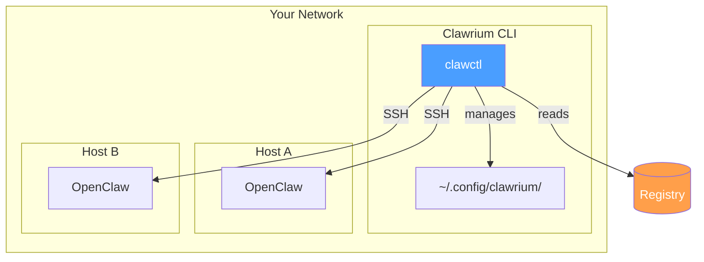
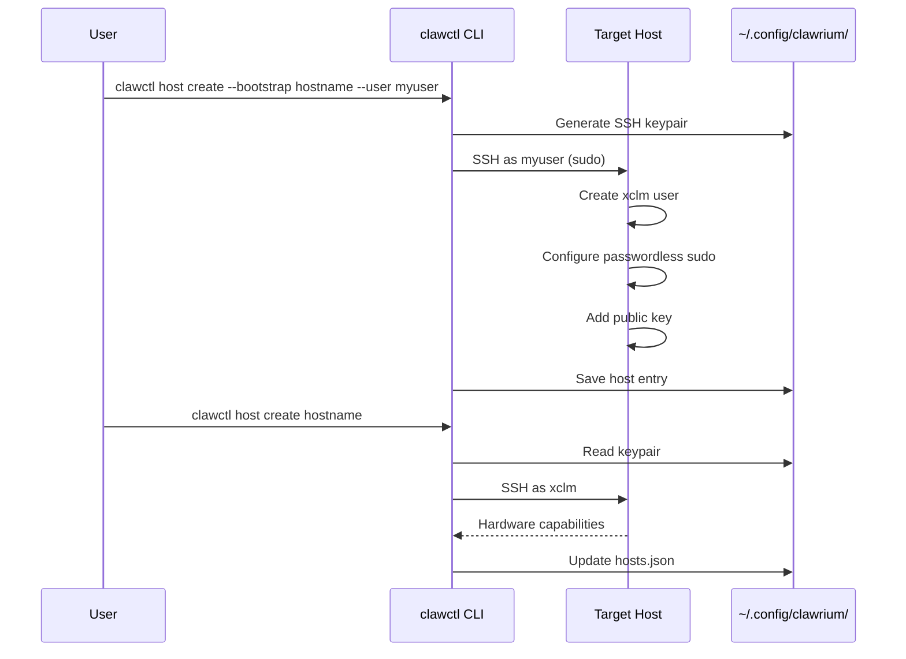
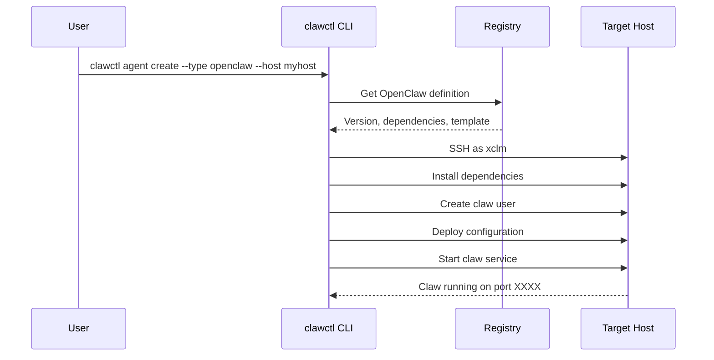
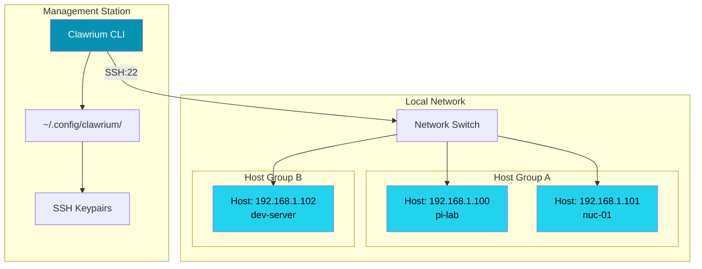
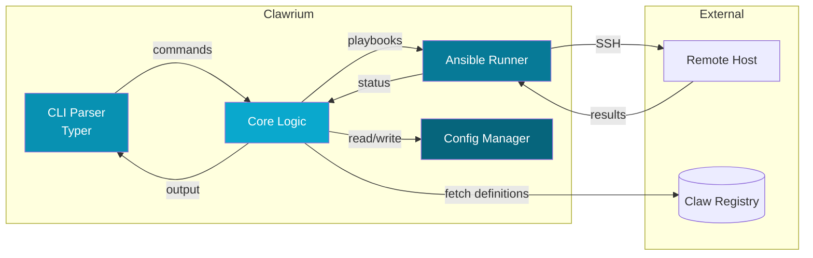
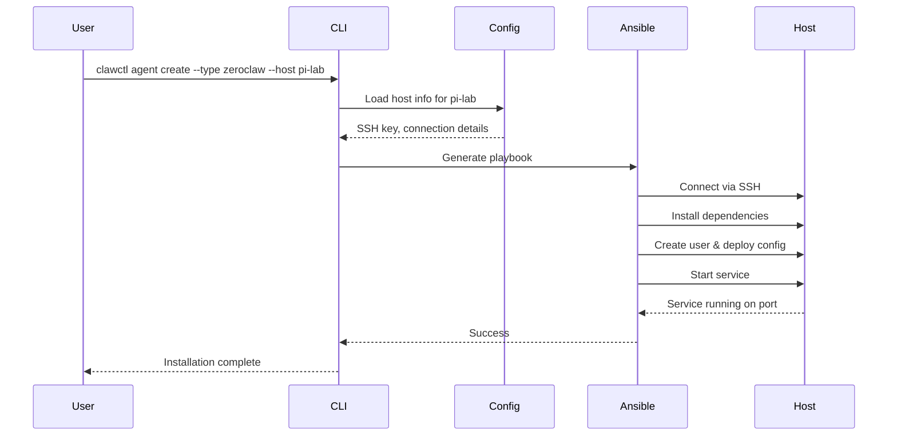
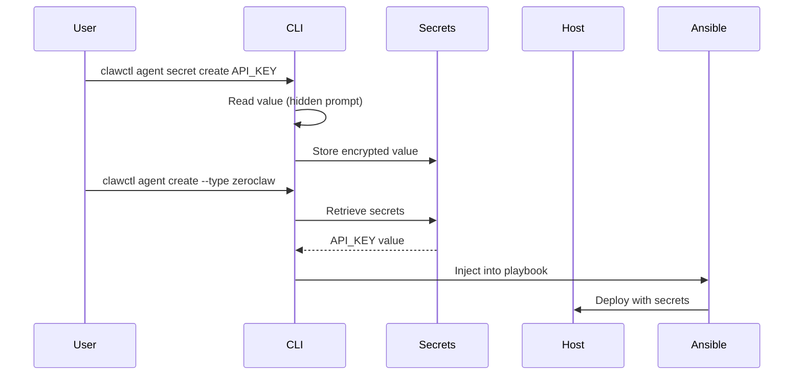
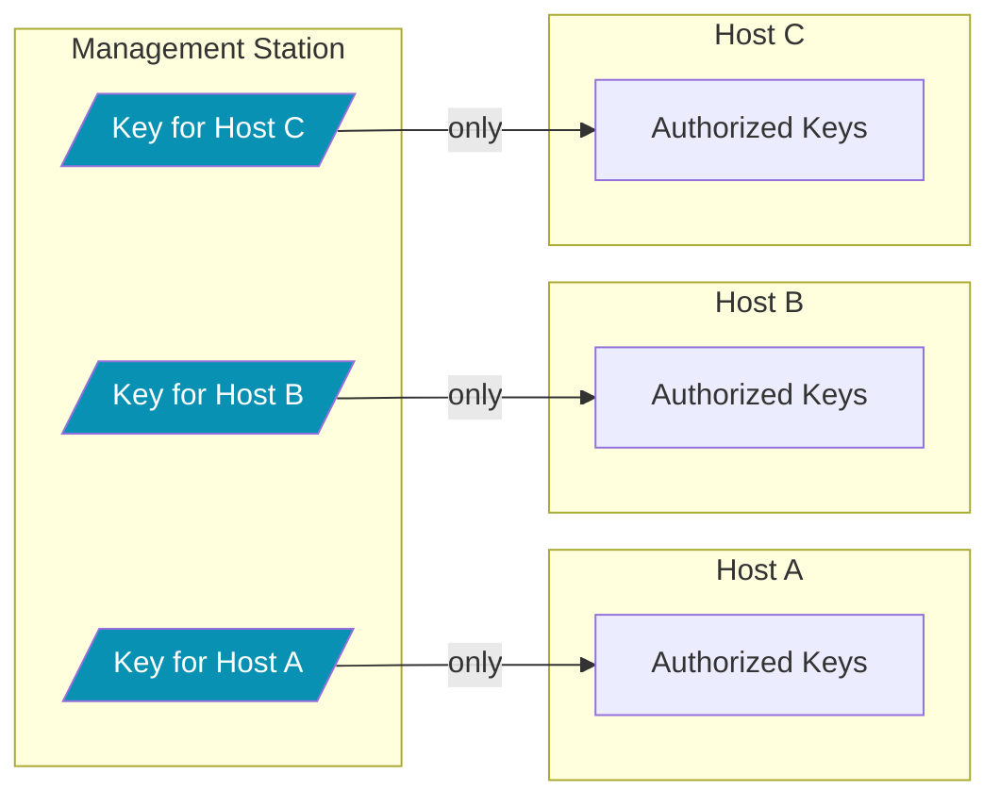

# Architecture

Clawrium manages AI assistant deployments across your network through three key concepts: **Hosts**, **Claws**, and the **Registry**.


## Key Concepts



### Host

A **Host** is any machine on your network that runs one or more claws. Clawrium connects to hosts via SSH using a dedicated management user (`xclm`).

**Characteristics:**
- Direct network access required (no ProxyJump support in v1)
- Per-host SSH keypair for security isolation
- Hardware capabilities detected automatically (CPU, GPU, memory)

### Claw

A **Claw** is an AI assistant instance. Today, Clawrium supports OpenClaw for end-to-end deployment and management.

**Current support:**
- OpenClaw

**Planned:**
- ZeroClaw and additional claw types

### Registry

The **Registry** defines available claw types with their versions, dependencies, and installation templates. It's the source of truth for what can be deployed.

## Host Management Flow



**Steps:**

1. **Initialize** (`clawctl host create --bootstrap`): Generates per-host keypair, configures xclm user
2. **Add** (`clawctl host create`): Verifies connectivity, detects hardware, saves to config
3. **Manage**: List, check status, or remove hosts as needed

## Claw Installation Flow



**The installation process:**

1. Reads claw definition from registry
2. Installs system dependencies via Ansible
3. Creates unprivileged user for the claw instance
4. Deploys normalized configuration (translated to claw-native format)
5. Starts the claw as a systemd service

## Data Storage

All user data is stored locally in `~/.config/clawrium/`:

```
~/.config/clawrium/
├── hosts.json          # Host registry (0600 permissions)
├── secrets.json        # API keys and credentials (0600)
└── keys/
    └── <hostname>/
        ├── xclm_ed25519      # Private key (0600)
        └── xclm_ed25519.pub  # Public key
```

**Security notes:**
- Private keys are stored with `0600` permissions
- Each host has isolated keypairs (compromise of one doesn't affect others)
- Secrets are encrypted at rest (planned)

## Network Topology

Clawrium operates on a flat network topology where the management station has direct SSH access to all hosts.



**Network Requirements:**
- Direct IP connectivity (no ProxyJump support in v1)
- SSH port 22 open on all hosts (or custom port with `--port`)
- Management station can reach all hosts

## Component Interaction

The following diagram shows how Clawrium components interact during typical operations.



**Component Responsibilities:**

| Component | Responsibility |
|-----------|----------------|
| CLI Parser | Command parsing, argument validation, help text |
| Core Logic | Business logic, state management, orchestration |
| Ansible Runner | Executes playbooks on remote hosts |
| Config Manager | Reads/writes configuration files |
| Registry | Claw type definitions and templates |

## Data Flow

### Configuration to Deployment



### Secret Management Flow



## Security Model

### Principle of Least Privilege

Each component operates with minimal required permissions:

| Component | Privileges |
|-----------|------------|
| Clawrium CLI | User-level, reads/writes `~/.config/clawrium/` |
| xclm user | Passwordless sudo for specific commands |
| Claw instances | Unprivileged user, no sudo access |

### SSH Key Isolation

Each host has a dedicated SSH keypair:



**Benefits:**
- Compromise of Host A's key doesn't affect Host B or C
- Easy key rotation per host
- Clear audit trail per connection
