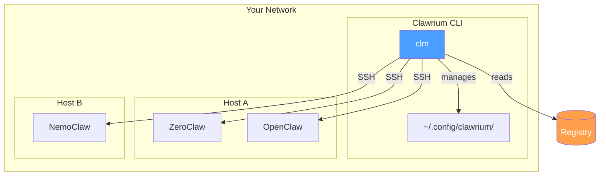
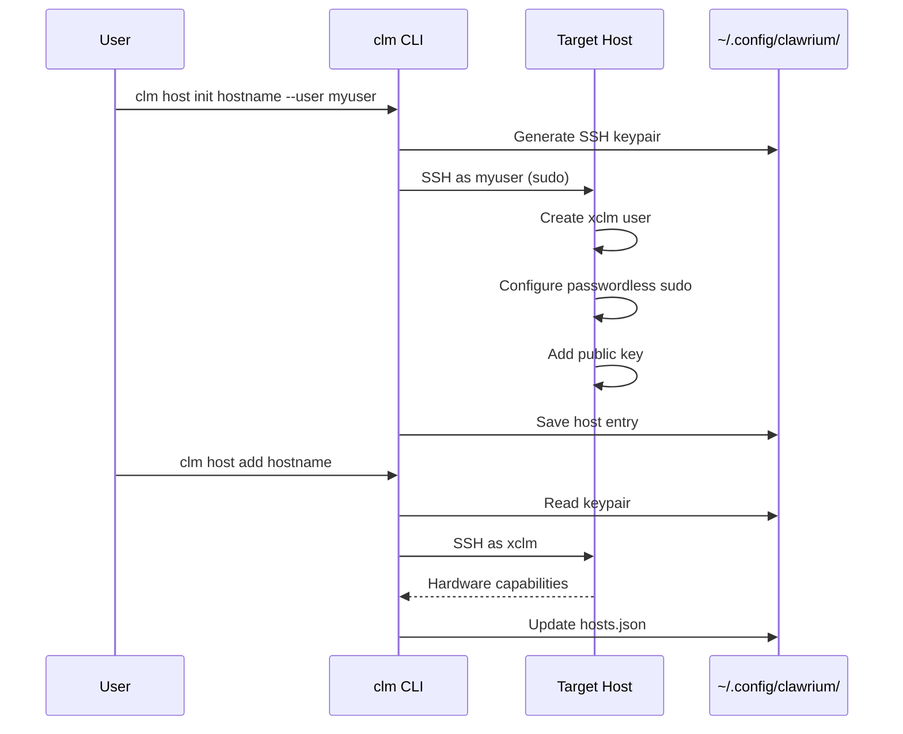
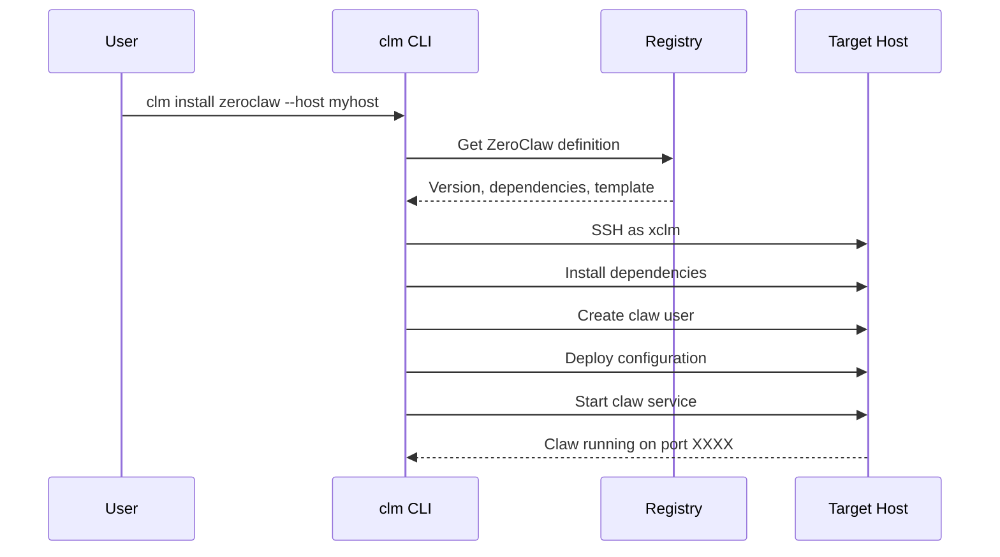

# Architecture

Clawrium manages AI assistant deployments across your network through three key concepts: **Hosts**, **Claws**, and the **Registry**.

## Key Concepts



### Host

A **Host** is any machine on your network that runs one or more claws. Clawrium connects to hosts via SSH using a dedicated management user (`xclm`).

**Characteristics:**
- Direct network access required (no ProxyJump support in v1)
- Per-host SSH keypair for security isolation
- Hardware capabilities detected automatically (CPU, GPU, memory)

### Claw

A **Claw** is an AI assistant instance. Each claw type (ZeroClaw, OpenClaw, NemoClaw, etc.) has its own configuration format, but Clawrium provides a normalized interface.

**Supported claws:**
- ZeroClaw
- OpenClaw
- NemoClaw
- NanoClaw
- IronClaw

### Registry

The **Registry** defines available claw types with their versions, dependencies, and installation templates. It's the source of truth for what can be deployed.

## Host Management Flow



**Steps:**

1. **Initialize** (`clm host init`): Generates per-host keypair, configures xclm user
2. **Add** (`clm host add`): Verifies connectivity, detects hardware, saves to config
3. **Manage**: List, check status, or remove hosts as needed

## Claw Installation Flow



**The installation process:**

1. Reads claw definition from registry
2. Installs system dependencies via Ansible
3. Creates unprivileged user for the claw instance
4. Deploys normalized configuration (translated to claw-native format)
5. Starts the claw as a systemd service

## Data Storage

All user data is stored locally in `~/.config/clawrium/`:

```
~/.config/clawrium/
├── hosts.json          # Host registry (0600 permissions)
├── secrets.json        # API keys and credentials (0600)
└── keys/
    └── <hostname>/
        ├── xclm_ed25519      # Private key (0600)
        └── xclm_ed25519.pub  # Public key
```

**Security notes:**
- Private keys are stored with `0600` permissions
- Each host has isolated keypairs (compromise of one doesn't affect others)
- Secrets are encrypted at rest (planned)
