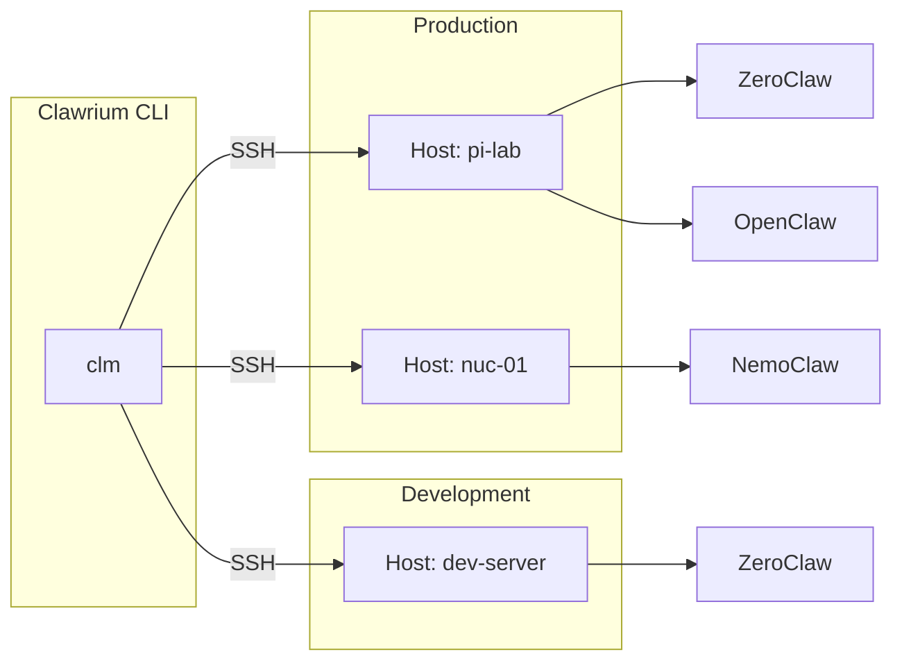
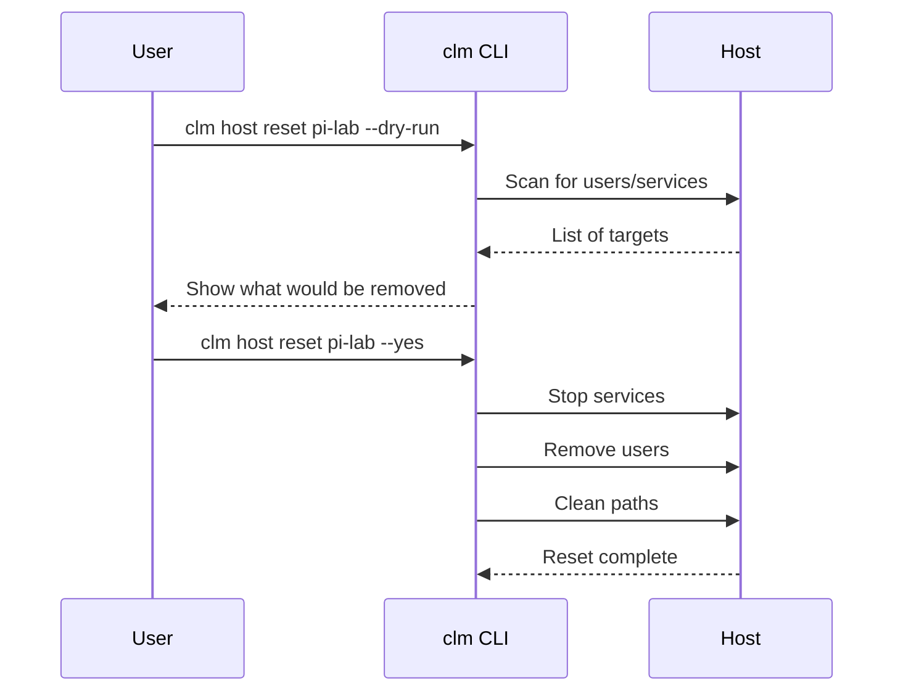
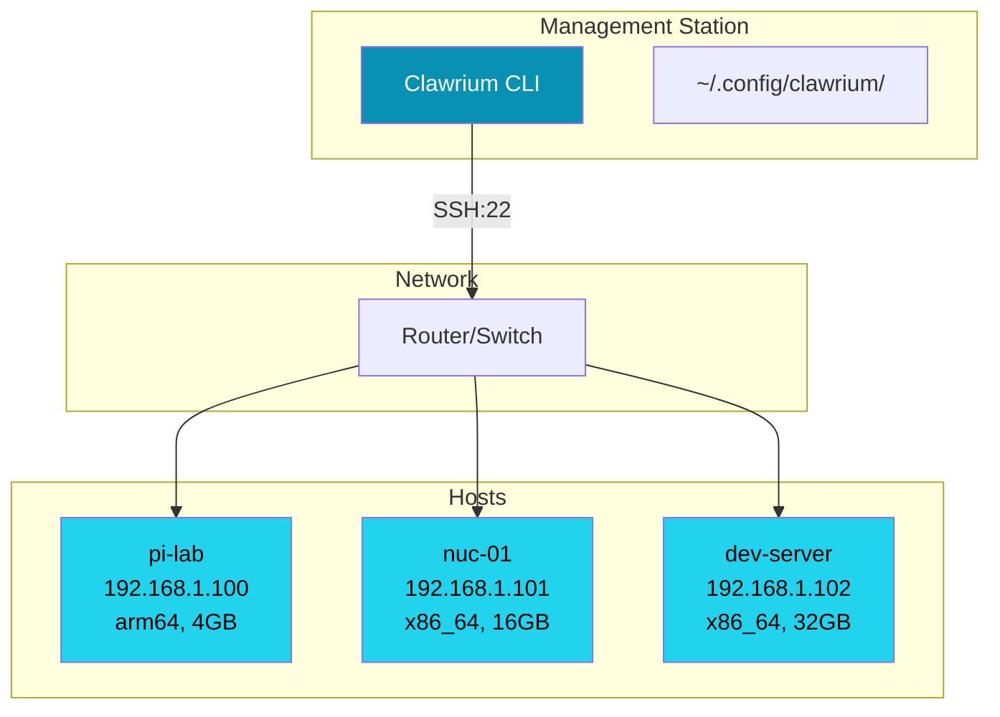

# Fleet Management

This guide covers managing multiple hosts and claws in your Clawrium fleet.

## Overview



## Host Organization

### Using Tags

Tags help organize and filter hosts in your fleet:

```bash
# Add hosts with tags
clm host add 192.168.1.100 --alias pi-lab --tags production,arm,edge
clm host add 192.168.1.101 --alias nuc-01 --tags production,x86
clm host add 192.168.1.102 --alias dev-server --tags dev,x86

# List all hosts
clm host list
```

Tags can represent:
- **Environment**: `production`, `staging`, `dev`
- **Architecture**: `x86`, `arm`, `gpu`
- **Location**: `us-west`, `eu-central`
- **Purpose**: `edge`, `compute`, `storage`

### Hardware Awareness

Clawrium automatically detects hardware capabilities:

| Property | Description |
|----------|-------------|
| Architecture | CPU architecture (x86_64, aarch64) |
| CPU Cores | Number of logical cores |
| Memory | Available RAM in GB |
| GPU | Detected GPU (if any) |

Use `--refresh` to update hardware info after changes:

```bash
clm host status pi-lab --refresh
```

## Multi-Host Operations

### Checking Fleet Health

Monitor hosts in your fleet individually:

```bash
# Check each host
clm host status pi-lab
clm host status nuc-01
clm host status dev-server
```

### Deploying Across Fleet

Deploy the same claw to multiple hosts:

```bash
# Install ZeroClaw on multiple hosts
clm agent install --type zeroclaw --host pi-lab --yes
clm agent install --type zeroclaw --host nuc-01 --yes
clm agent install --type zeroclaw --host dev-server --yes
```

### Managing Configuration

Keep configuration synchronized across hosts:

```bash
# Set secrets on multiple hosts
clm secret set OPENAI_API_KEY --host pi-lab
clm secret set OPENAI_API_KEY --host nuc-01
clm secret set OPENAI_API_KEY --host dev-server
```

## Reset Operations

### Pre-Reset Checklist

Before resetting a host:

1. **Check for running claws**
   ```bash
   clm host status pi-lab
   ```

2. **Review what will be removed**
   ```bash
   clm host reset pi-lab --dry-run
   ```

3. **Backup any custom configuration**
   ```bash
   # SSH into host and backup custom configs
   ssh xclm@pi-lab "tar -czf /tmp/claw-backup.tar.gz ~/.config/"
   ```

### Executing Reset



**Reset removes:**
- All users with UID >= 1000 (except xclm)
- All `*claw` systemd services
- Clawrium-managed configuration paths

**Reset preserves:**
- The xclm management user
- System configuration
- Network settings

### Post-Reset

After reset, the host is still tracked:

```bash
# Verify host is still in fleet
clm host status pi-lab

# To remove tracking as well
clm host reset pi-lab --yes --untrack
```

## Multi-Host Architecture

### Network Topology



### SSH Key Management

Each host has an isolated SSH keypair:

```
~/.config/clawrium/keys/
├── 192.168.1.100/
│   ├── xclm_ed25519      # Private key
│   └── xclm_ed25519.pub  # Public key
├── 192.168.1.101/
│   ├── xclm_ed25519
│   └── xclm_ed25519.pub
└── 192.168.1.102/
    ├── xclm_ed25519
    └── xclm_ed25519.pub
```

**Benefits of per-host keypairs:**
- Compromise of one host doesn't affect others
- Easy to revoke access for specific hosts
- Audit trail per host

### Security Considerations

1. **File Permissions**
   ```bash
   # Clawrium sets these automatically, but verify:
   ls -la ~/.config/clawrium/
   # hosts.json should be 0600
   # keys/*/xclm_ed25519 should be 0600
   ```

2. **Network Access**
   - Direct SSH access required (no ProxyJump in v1)
   - Port 22 must be open on all hosts
   - Consider firewall rules for management station

3. **xclm User**
   - Has passwordless sudo access
   - Dedicated to Clawrium management
   - Should not have additional privileges

## Best Practices

### Fleet Organization

1. **Use consistent naming**
   - Location-based: `us-west-01`, `eu-central-02`
   - Function-based: `compute-01`, `edge-01`
   - Hybrid: `us-west-compute-01`

2. **Apply tags consistently**
   ```bash
   # Good: Multiple relevant tags
   --tags production,us-west,gpu

   # Avoid: Overly specific tags
   --tags production-us-west-2024
   ```

3. **Regular health checks**
   ```bash
   # Run periodic health checks manually
   clm status
   ```

### Change Management

1. **Test on dev hosts first**
   ```bash
   # Deploy to dev
   clm agent install --type zeroclaw --host dev-server --yes
   # Verify
   # Then deploy to production
   clm agent install --type zeroclaw --host pi-lab --yes
   ```

2. **Document host configurations**
   - Keep a fleet manifest
   - Track which claws are on which hosts
   - Note any custom configurations

3. **Backup before changes**
   ```bash
   # Export host configs
   cp ~/.config/clawrium/hosts.json ~/.config/clawrium/hosts.json.backup
   ```
